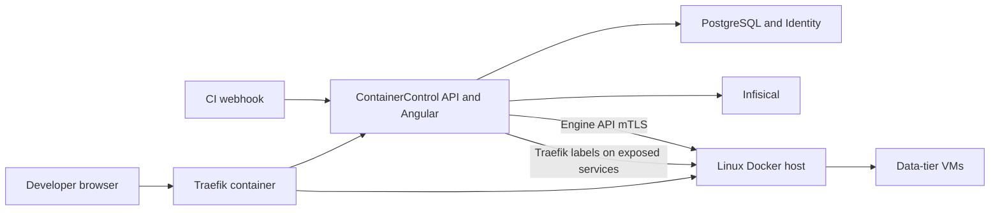
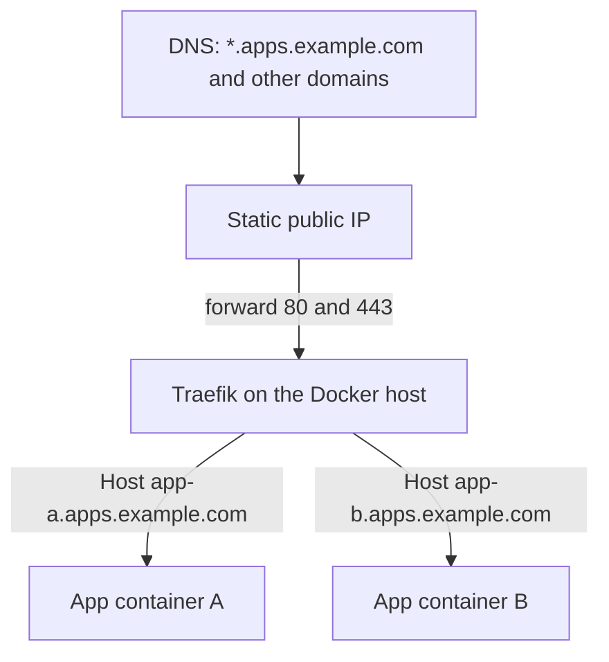
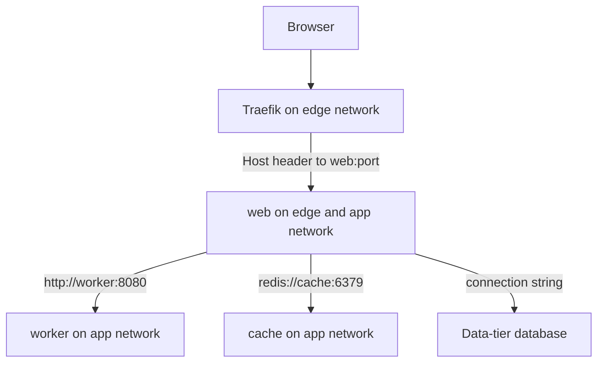

# ContainerControl platform plan

Self-service container hosting for internal apps. Developers never get VM or Docker socket access. Admins run a Windows Server Hyper-V host; production Docker runs on Linux VM guests. ContainerControl is the control plane.

Confirmed choices: custom control plane via the Docker Engine API (`Docker.DotNet`, MIT), and Infisical (Apache-2.0) as the secrets store. No Portainer and no commercial libraries. Sign-in is ASP.NET Core Identity. Entra ID is a later external login, not part of v1.

Three different people show up in this plan:

- **Admin** installs Docker Engine on the Linux VM and leaves it running. The same person then signs into ContainerControl for users, hosts, allowed domains, registries, and quotas. Starting the app finishes the Docker-side setup it can reach.
- **Developer** is a ContainerControl user who configures and deploys their own applications.

## Assumptions

- **Hosting is on-premises.** ContainerControl, PostgreSQL, and Infisical run on a dedicated Linux management VM. That VM is not a tenant app host. App workloads run on a Linux Docker host. Traefik is a container on that same Docker host, using the Docker provider from the [Traefik Docker quick start](https://doc.traefik.io/traefik/getting-started/docker/). It is not a package installed on the guest OS, and it is not a separate edge VM. Platform skill: [enterprise-architecture-onprem.md](.cursor/skills/enterprise-architecture-onprem.md).
- **Control-plane database is PostgreSQL, locally and in production.** SQL Server is a licensed product and conflicts with the open-source-only constraint. Local PostgreSQL is started by Docker Compose, not installed by hand and not replaced with SQLite. SQLite would diverge from Identity, schemas, and concurrency on the real engine.
- **Stack is .NET 10 and Angular 21.** The API targets `net10.0`. The client is an Angular 21 SPA created with the Angular 21 CLI. Node.js 22 LTS is the local runtime for the client.
- **Web client is an online-only Angular SPA.** No PWA and no Ionic. Deploys require the management network; offline use is out of scope.
- **The UI stays plain.** One navigation list, tables, and forms. Pages are easy to scan. There is no custom visual system, no dashboard graphics, and no extra component library. Follow [AGENTS.md](AGENTS.md) as the orchestrator reference. The deleted `00-master.md` is not used.
- **Sign-in is ASP.NET Core Identity on the same PostgreSQL database** (`IdentityDbContext`, cookie auth). An admin with `access.users.manage` creates each user. There is no self-registration. Browser calls use an HTTP-only SameSite cookie. CI uses first-party API tokens hashed in PostgreSQL. Identity's built-in role table is not used for authorization. Follow [enterprise-microsoft-identity-authentication.md](.cursor/skills/enterprise-microsoft-identity-authentication.md).
- **Entra ID comes later.** `Microsoft.Identity.Web` can be added as an external login that links only to a user an admin already created. Unknown Entra accounts are rejected. v1 does not take a dependency on Entra.
- **Authorization is permission-based.** Seeded permission codes, admin-composed roles, checks via permission code only. Follow [enterprise-permission-based-access.md](.cursor/skills/enterprise-permission-based-access.md).
- **No CQRS and no MediatR.** Application services inside each module.
- **One replica per app in v1.** The operator pins an app to one Linux host. Auto-scale, blue/green, and canary stay deferred.
- **Production databases stay on the admin-provisioned data tier.** Compose may include app, cache, and worker services. Database images (PostgreSQL, MySQL, SQL Server, MongoDB, and similar) are rejected by policy. Devs receive connection strings as Infisical references.
- **Linux hosts only in v1.** `HostKind` can be `Linux` or `Windows`, but scheduling targets Linux. Windows containers stay a later host, not the default.
- **Images are pre-built.** CI (Jenkins, GitLab CE, or Woodpecker) pushes to a registry. Compose `build:` is rejected.

## Runtime topology

- Docker Engine is reached only over **TLS with mutual auth** on the management VLAN. The API never shells out to the `docker` CLI and never publishes the raw socket.
- Registry credentials and Docker client certificates live in Infisical. PostgreSQL stores references (path + environment), never values.
- Traefik runs as the official image on the app Docker host and mounts only that host's local socket, as in the Docker provider guide. It is not installed with a package manager, and it is not given a remote socket. ContainerControl sets Traefik labels on exposed services through the Engine API. Other services stay on an internal compose network and have no public port. The production container publishes 80 and 443 and leaves `--api.insecure` off. The quick start's open dashboard on port 8080 is only a local learning example.

## How one public IP serves many hostnames

The admin points the domain at one static public IP, and the firewall forwards ports 80 and 443 to the Docker host. Every application hostname arrives at the same Traefik. Traefik reads the `Host` header and sends the request to the matching container. No extra Docker port, virtual host, or DNS record is required per application when the name sits under a wildcard that already points at that IP.

One-time, done by the admin outside ContainerControl:

- A wildcard record such as `*.apps.example.com`, and any extra apex domain, all point at the same static public IP.
- The firewall forwards 80 and 443 to Traefik on the Docker host.
- The Traefik container is started once on that host, with the local Docker socket mounted and an ACME certificate volume.

Automatic on each deploy, done by ContainerControl when a developer sets a hostname and marks a service exposed:

- The exposed container joins a shared edge network that Traefik already uses.
- Labels route `Host(that hostname)` to the container's internal port. Containers are not published on the host.
- Traefik requests a Let's Encrypt certificate for that hostname over HTTP-01, which works because port 80 already reaches Traefik.
- Removing the app or turning exposure off removes those labels, so the hostname stops routing.

A new subdomain under the wildcard needs nothing on the DNS provider or on the server. A brand-new domain, such as `other.com`, still needs the admin to add one A record to the same public IP and to add that domain to the allowed-domain list in ContainerControl. After that, apps on that domain are routed automatically. Internal-only names that cannot use Let's Encrypt keep the manual certificate upload path.

A second Docker host is not behind this Traefik automatically. v1 places exposed apps on the host that owns the public forward.

## Modular monolith

One ASP.NET Core host, one PostgreSQL database, schema per module. Modules talk through in-process interfaces, not cross-schema writes. Scaffold with `dotnet new` on the .NET 10 SDK and `ng new` from Angular CLI 21, per [enterprise-net-api-scaffold.md](.cursor/skills/enterprise-net-api-scaffold.md) and [enterprise-angular-app-scaffold.md](.cursor/skills/enterprise-angular-app-scaffold.md).

- **Access** — ASP.NET Core Identity users, teams, permission roles, permission catalog, API tokens, time-boxed break-glass grants, append-only audit. Login, logout, and user create/disable live here.
- **Platform** — Docker hosts, team quotas (CPU, memory, storage), allowed public domains, capacity readings.
- **Registries** — connections typed `Acr`, `Ecr`, `DockerHub`, or `Harbor`. ACR uses a scoped `AcrPull` service principal. An `IHostedService` refreshes ECR tokens before the 12-hour expiry. Harbor is the self-hosted registry; `registry:2` is not a product target.
- **Applications** — desired state: team, environment (`dev` / `staging` / `prod`), image or compose document, secret references, hostname, internal ports, exposure flag, host placement. Secret values are written through to Infisical from this module.
- **Delivery** — compose policy, translation of the allowed compose subset onto Engine API calls, deploy / redeploy / rollback / start / stop / restart, optional prod approval, deployment history. A single worker lease row prevents double execution on one management VM.
- **Edge** — Traefik labels for exposed services, Let's Encrypt vs uploaded certs, and the allowed-domain check. v1 does not write DNS records.
- **Runtime** — live logs over SignalR from the Engine log API, historical logs within daemon retention, per-service status and `stats`. No separate log product in v1.

Shared kernel stays small: current user, clock, audit sink, problem-details. Serilog plus OpenTelemetry to a local collector. `/health/live` and `/health/ready`.

## Compose policy and deploy path

Validate YAML before any Engine call. Reject `privileged`, `network_mode: host`, `pid`/`ipc: host`, bind mounts, the Docker socket, `cap_add`, devices, `build`, and database images. Allow named volumes, internal networks, healthchecks, restart policy, and explicit resource limits.

Only services marked exposed receive Traefik labels and a place on the shared `edge` network. Every service in the app also joins that app's private network, where Docker DNS resolves compose service names. At deploy time the worker reads each secret from Infisical in that app's environment and injects it as an env var or a file under `/run/secrets/`. A dev app cannot read a prod path. Values are not written to PostgreSQL, logs, or the API response. The hostname must fall under a domain an admin has allowed. Those domains are the ones already pointed at the static public IP.

Rollback restores the last successful desired state and redeploys it. Approval, when enabled on an app or on `prod`, parks the run until a caller with `deploy.approve` accepts it.

Break-glass is a short-lived permission grant through the same API, written to the audit log. It does not open a shell on the VM or the socket.

## Secrets from ContainerControl

After the operator has installed Infisical and supplied the API's machine credentials, admins and developers add, update, and remove secrets in the ContainerControl UI. They do not use the Infisical UI for day-to-day work.

- Create sends the name, environment, injection mode (env var or file), and value to the API. The API writes the value to Infisical and stores only the path, environment, and injection mode.
- Update replaces the value in Infisical. The current value is never returned to the browser.
- Delete removes it from Infisical and drops the reference.
- The list shows names and injection mode only. Inputs are masked after entry.
- A dev or staging app can use secrets in that same environment. Prod secret changes require `secrets.manage.prod`.
- The audit log records who created, updated, or deleted a path. It does not record the value.
- The Infisical machine credentials that bootstrap this live in the API host configuration, because they cannot themselves be stored in Infisical. Use a separate credential per environment so a dev write cannot change prod.

## DNS and hostnames

DNS stays at the provider. The admin points the domain, preferably with a wildcard, at the static public IP and forwards 80 and 443 to the Docker host. ContainerControl does not create those records in v1.

- An admin with `edge.dns.manage` saves the allowed domains, such as `apps.example.com`. A developer can only claim a hostname under one of those domains.
- On deploy, ContainerControl attaches Traefik labels for that hostname. Traefik on the Docker host picks them up from the local socket and obtains the certificate.
- Changing the hostname replaces the labels. Removing the app or turning exposure off removes them.
- Per-app DNS automation through RFC 2136 is deferred. It is only useful later if a wildcard is not available and someone wants the app to create each A record itself.

## How services communicate after deployment

ContainerControl does not leave a compose file for Docker Compose to run. On deploy it creates the same networks through the Engine API, and it sets each container's network alias to the compose service name. Inside an application, `http://cache:6379` works the way it does in Compose, because Docker's DNS on a user-defined bridge resolves that alias.

- **One private network per application**, named from the app id. Services of that app can resolve each other by compose service name. Another app's `cache` is not on this network, so names do not collide and apps cannot reach each other.
- **One shared `edge` network.** Traefik is attached to it. Only services marked exposed are also attached to it. Traefik's label `traefik.docker.network=edge` makes it use that path. Internal services have no host port and no edge attachment.
- **Start order.** The worker starts dependency services first and waits for a healthcheck when the compose file defines one. The Engine API does not do that by itself.
- **Data-tier databases** are reached by hostname in the injected connection string. They are not containers on the app network.
- **The control plane** is not on tenant networks. The API talks to PostgreSQL and Infisical over their own addresses, and to Docker only through the Engine API.

Locally this is the same Docker behavior. Early steps run the API on the host against Compose PostgreSQL. Later steps point the API at the local Engine socket and create real app networks beside the control-plane Compose project.

## Prerequisites

Tools installed once on a developer machine. Production Docker Desktop is out of scope; local Docker Engine runs in WSL2, which the requirements already treat as a dev tool.

- Windows with WSL2, or a Linux machine
- Docker Engine inside WSL2, so Compose can start PostgreSQL
- .NET 10 SDK
- Node.js 22 LTS and the Angular 21 CLI
- Git

Compose starts these. They are not installed by hand.

- **From the first step:** PostgreSQL, via `deploy/local/compose.yaml`
- **Only when that step starts:** Infisical, Traefik, and a sample target container. Each is a Compose profile turned on for that step

Not required to build or run the control plane locally: a public IP, a DNS provider, Hyper-V, Harbor, ACR, ECR, or the data-tier VMs.

The same setup is wrapped in three scripts so nobody has to remember the commands: [scripts/dev-setup.ps1](scripts/dev-setup.ps1), [scripts/dev-setup.sh](scripts/dev-setup.sh), and [scripts/dev-setup.bat](scripts/dev-setup.bat). Each script checks the prerequisites, starts the PostgreSQL Compose file, and prints the `dotnet run` and `ng serve` commands. The `.bat` file delegates to the PowerShell script. Later steps add a flag or profile argument for Infisical and Traefik rather than a second set of scripts.

## Step-by-step verification

Each step is done only after the previous check passes. Automated tests for that slice are part of the check. Later steps do not start on a failing earlier one.

1. **API boot.** `docker compose up` starts PostgreSQL. The API migrates and `/health/ready` reports the database healthy.
2. **Sign-in.** A Development seed user can sign in and call `/me/permissions`. A missing user is rejected.
3. **Permissions.** A developer role cannot call a host-admin endpoint. An admin role can.
4. **Docker connection.** Register the local Engine and complete a version ping. No container is created yet.
5. **Secrets.** Create a secret in the UI, confirm Infisical holds it, confirm PostgreSQL does not, and confirm a read API returns the name only.
6. **Single container.** Deploy one image with no compose file. It reaches the running state and can be stopped and started.
7. **App network.** Deploy web plus cache. From the web container, the cache name resolves on the app network. A second app's cache does not.
8. **Compose policy.** A file with `privileged: true`, a bind mount, or a database image is rejected and creates nothing.
9. **Public route.** With the local Traefik profile, an exposed hostname on the edge network returns the app response. An unexposed service does not.
10. **Logs and lifecycle.** The log tail shows container output, stats return CPU and memory, and rollback restores the previous spec.
11. **CI trigger.** An API token calls the deploy webhook and a token without `deploy.execute` is rejected.

## Permission catalog (seeded codes)

- Access: `access.users.read`, `access.users.manage`, `access.teams.manage`, `access.roles.manage`, `access.tokens.manage`, `access.breakglass.grant`, `access.audit.read`
- Platform: `platform.hosts.manage`, `platform.quotas.manage`, `platform.settings.manage`, `platform.capacity.read`
- Registries: `registries.read`, `registries.manage`
- Apps: `apps.read`, `apps.write` plus a team-membership resource check
- Secrets: `secrets.read`, `secrets.manage`, `secrets.manage.prod`
- Delivery: `deploy.execute`, `deploy.approve`, `deploy.rollback`
- Edge: `edge.certs.manage`, `edge.dns.manage`
- Runtime: `runtime.logs.read`, `runtime.stats.read`, `runtime.control`

Development seed only: sample users created through `UserManager`, sample teams, a platform-admin role, and a developer role. Production gets the catalog and no sample users. Tests create users in the Identity store directly, with no external identity server.

## Angular surfaces

The layout is a title, a short nav, and one content region. Admin pages and application pages are separate nav groups. Each page is a list or a single form. Actions are buttons with text labels. Empty and error states are one sentence each.

- **Sign-in:** email and password against the API. The Angular app sends the cookie with `withCredentials`.
- **Admin:** user create/disable, teams, role editor (catalog checkboxes), hosts, registries, quotas, allowed domains, audit, capacity as a simple table, approval queue, break-glass.
- **Developer:** app list and editor, secret create/update/delete (values write-only), hostname under an allowed domain, deploy history, start/stop/restart, log tail, service status.
- Guards and buttons call `hasPermission`. The API remains the authority.
- Where a task cannot be completed in the app, the page states the manual step in one short paragraph and points at the production guide. The page does not pretend the click finished the work.

## v1 boundaries

In scope: the admin and developer feature set in [requirements.md](requirements.md), including API tokens and a deploy webhook.

Deferred: per-app DNS record automation, Entra ID external login for pre-provisioned users, auto-scaling, multi-replica load balancing, blue/green and canary, Slack/email alerting, cost dashboards, template marketplace, Windows container scheduling, and a long-term log store such as Loki.

## ADRs to write under `docs/adr`

- On-prem modular monolith and PostgreSQL, cloud services out of scope.
- Custom Engine API client instead of Portainer.
- Secret values are written through ContainerControl into Infisical and never stored or displayed again.
- One public IP and a wildcard DNS record; Traefik on the Docker host routes many hostnames by labels. No per-app DNS writes and no Swarm in v1.
- Database images blocked; data tier is separate.
- Local PostgreSQL comes from Docker Compose. SQLite is not a second local database.
- Deployed apps communicate on a private Docker network by compose service name. Only exposed services join the edge network.
- .NET 10 and Angular 21, with a plain list-and-form UI.
- Online-only Angular; no CQRS.
- ASP.NET Core Identity cookies, admin-provisioned users, API tokens for CI. Entra ID linking is deferred.

## What startup automates

The admin installs Docker Engine and leaves it running. Docker Desktop is not used. The start scripts and the API then finish every step that only needs that engine or the local Compose project.

On each start of ContainerControl:

- Compose starts PostgreSQL and the Infisical container when they are not already running.
- The API applies EF migrations.
- If the database has no users, the API creates the first admin from the host environment variables.
- When the API can reach a Docker host, it creates the `edge` network if it is missing.
- If the Traefik container is missing on that host, the API creates it from the official image: ports 80 and 443, the local Docker socket, an ACME certificate volume, and `--api.insecure` left off. If that container is already running, startup leaves it in place and reports whether those settings still match.

The first production host is prepared when the admin saves it in ContainerControl, because the management VM cannot see Docker until that connection exists. Local development uses the local engine during the Traefik verification step, so the same check runs there.

Startup cannot do work that lives outside Docker:

- Create the Hyper-V VM, or install Docker Engine.
- Open the firewall or forward ports 80 and 443.
- Create DNS records at the provider.
- Create the Infisical machine identity. The container is running, and the production guide still has one manual pass through Infisical to create that identity and put the token in the host environment.
- Create a registry credential in ACR, ECR, Docker Hub, or Harbor.
- Install a data-tier database server, or buy a commercial certificate.

Local development uses the same networking rules as deployment. Compose starts PostgreSQL immediately. Infisical and Traefik stay behind Compose profiles until their verification step. Unit tests may fake the Engine and Infisical; the step check itself uses the real local component.

## Manual steps

Some work cannot be done safely or at all from ContainerControl. Those steps stay manual, with the exact commands and checks written in [docs/production-setup.md](docs/production-setup.md). The UI only links to that section.

- Create the Hyper-V Linux VM and install Docker Engine with mTLS. Leave Docker running. Docker Desktop is not used.
- At the DNS provider, point the domain and its wildcard at the static public IP. Forward ports 80 and 443 to that Docker host.
- Create the Infisical machine identity once the Infisical container is up, and put the token in the host environment.
- On first boot, sign in as the generated admin and create the real users. The app does not offer self-registration, and it does not seed sample users in production.
- Create the registry credential in ACR, ECR, Docker Hub, or Harbor. Then save the connection in ContainerControl.
- Create a brand-new apex domain at the DNS provider, then add it to the allowed-domain list in the app.
- Provision a data-tier database on its own VM. Add the connection string afterward as a secret in the app.
- Obtain a commercial certificate from the vendor when Let's Encrypt cannot issue one. Upload the certificate in the app.
- Rotate the Docker host client certificate on the host, then update the Infisical reference.

## Production setup

[docs/production-setup.md](docs/production-setup.md) is the admin guide for the steps startup cannot do. It is written as numbered steps, and each step ends with a check. The local scripts start the control plane; they are not the Hyper-V or DNS setup.

Steps, in order: create the VM, assign the public IP and firewall rules, create the DNS records, install Docker Engine and leave it running, start ContainerControl, create the Infisical machine identity, sign in, register the Docker host and confirm startup created Traefik and the edge network, save allowed domains, connect registries, provision data-tier databases, deploy one sample app on a hostname under the wildcard.

Do:

- Use the shipped production Compose file and the production guide.
- Keep 80 and 443 forwarded only to Traefik.
- Keep tenant containers on the private app network, with only the exposed service on the edge network.
- Create every user explicitly, then assign a role built from the permission catalog.
- Store secret values only through the ContainerControl secret form.
- Keep production databases on the data-tier VM.
- Confirm each numbered step before starting the next one.

Do not:

- Do not install Docker Desktop on the server, and do not publish the Docker socket over the network.
- Do not deploy, restart, or read logs by SSHing to the VM. Use ContainerControl for those actions.
- Do not put secret values in a compose file, a git-tracked env file, or the ContainerControl database.
- Do not turn on self-registration or run the Development user seed in production.
- Do not give developers a VM login, a Docker socket, or the Infisical machine credential.
- Do not run production database images inside an application compose file.
- Do not save a hostname whose domain is not already pointed at the public IP.
- Do not add Portainer, Keycloak, or a commercial control-panel product beside this stack.

## Delivery sequence

[AGENTS.md](AGENTS.md) is the orchestrator reference. Architecture records the ADRs, then implementation follows the verification steps in order. The API host, Identity, and Angular sign-in are steps 1–3. Docker, Infisical, deploy, networking, and Traefik are steps 4–9. Logs, lifecycle, and the webhook are steps 10–11. The local setup scripts land with step 1. The production guide is updated whenever a manual step becomes clear, and it is complete by the last step. Security review follows each slice. Specialists stay the roster in [AGENTS.md](AGENTS.md). Auth uses the Microsoft Identity cookie skill. No new agent is required.

## Risks

- Compose is not part of the Engine API. v1 implements a documented subset, not full Compose spec compatibility. Service-name DNS works only when ContainerControl sets the network alias; a missed alias means the containers start and then cannot find each other.
- Let's Encrypt cannot issue for names that are not publicly resolvable. Those names need an uploaded cert. A wildcard DNS record does not by itself create a wildcard certificate; Traefik still issues a certificate per hostname.
- A second Docker host does not receive public traffic until something in front of it can route there. v1 keeps exposed apps on the host behind the public IP.
- One management VM means the control plane is not highly available. The worker lease must stay single-active.
- ECR refresh and Infisical outages block deploys; they must surface as failed runs, not partial containers with empty secrets.
- mTLS certificate rotation for Docker hosts is an ops task owned by Platform, stored as Infisical references.
- Startup creates Traefik only when that container is absent. A container left from an older experiment is reported, not replaced.
- The Infisical bootstrap credentials on the API host can write secrets. Split them by environment so a dev credential cannot change prod.
- A hostname under a domain the admin has not pointed at the public IP will get a Traefik route and still fail in the browser. The allowed-domain list is what keeps those names from being saved.