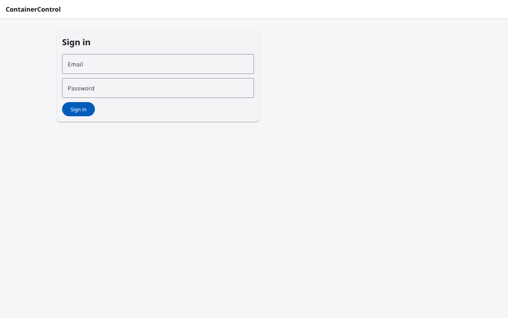
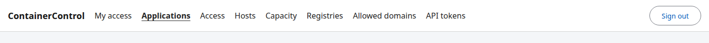
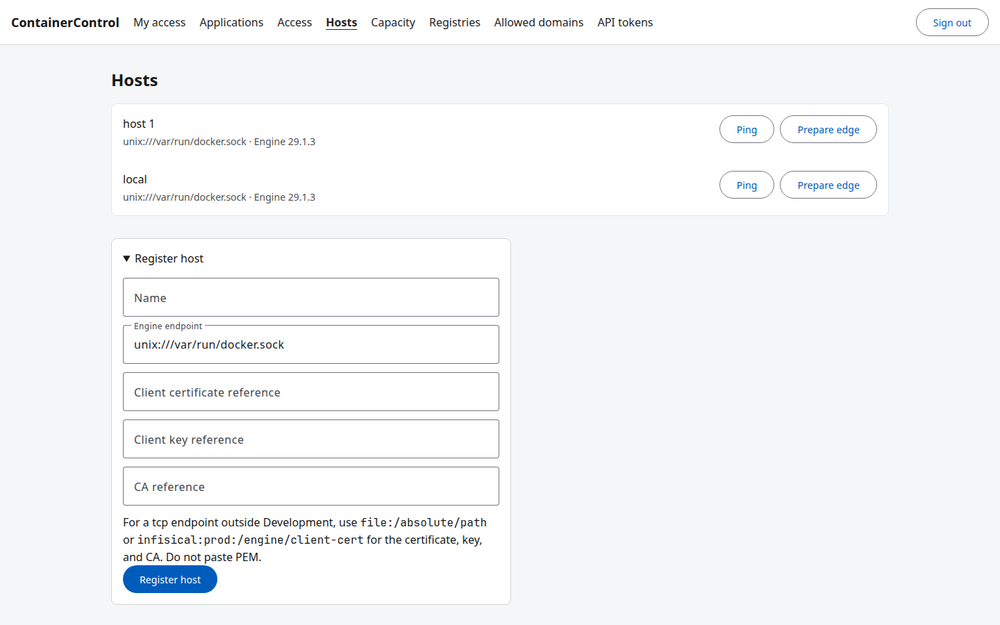
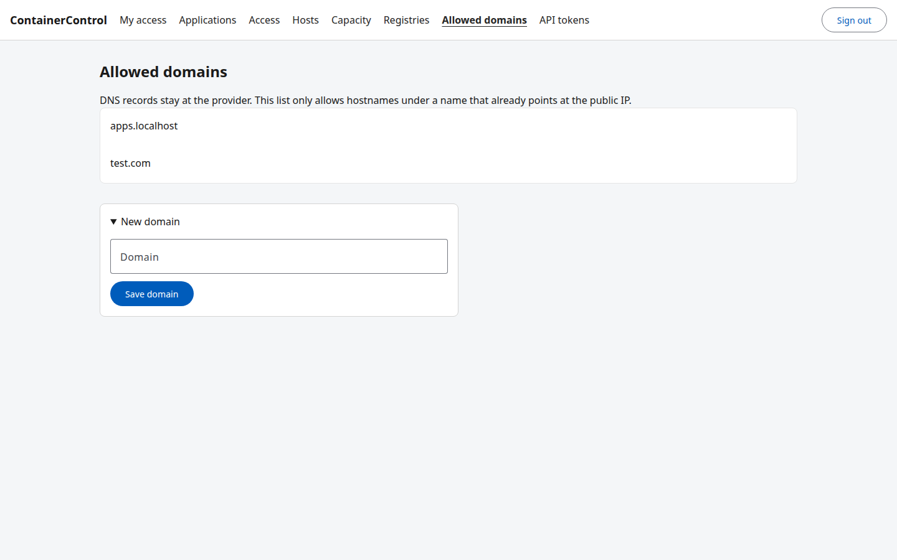
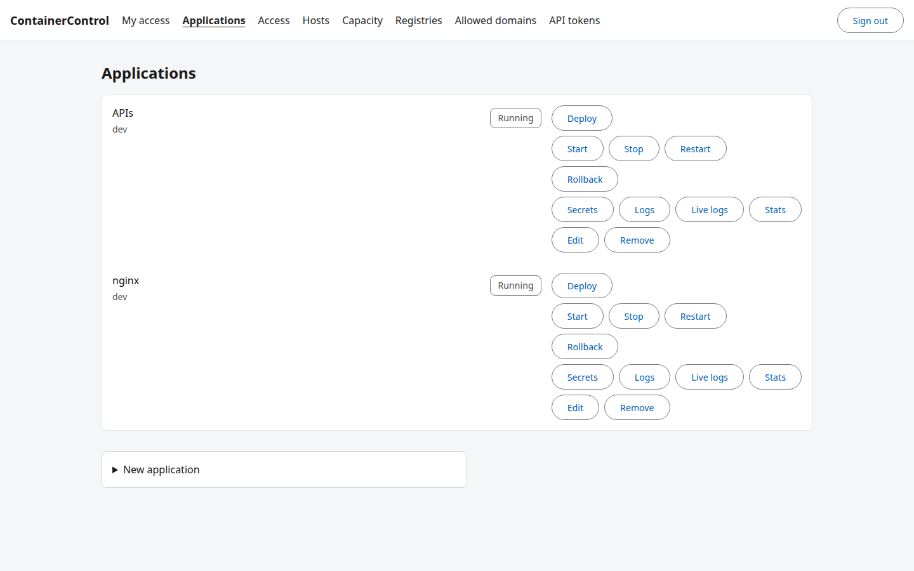
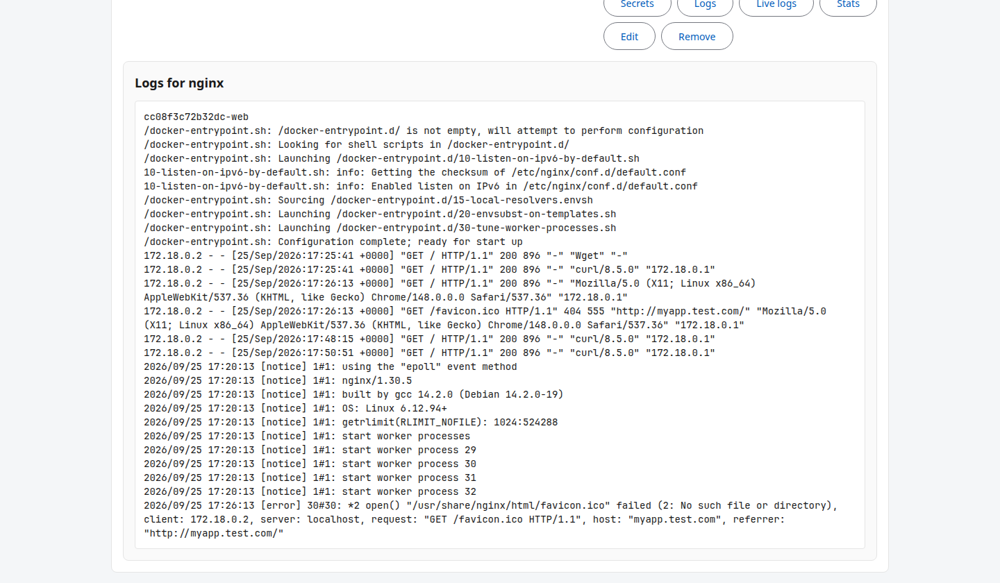

# User guide

ContainerControl is the place administrators and developers run applications on a Docker host. Administrators register the host, allow domains, and assign permissions. Developers register an application, deploy it, and read its logs. Nobody gets a VM login or the Docker socket.

Sign in at `/sign-in`. The header shows only the pages your permissions allow. A missing permission removes the link. It does not leave a disabled one. After a role change, sign out and sign in again so the cookie picks up the new permissions.

Local Development accounts are listed in the [README](../README.md). Do not use them in production. Work the product cannot do, including DNS records, the Linux VMs, and Docker Engine install, stays in [Production setup](production-setup.md).

## Sign in



1. Open the app and choose **Sign in** if you are not already there.
2. Enter the email and password an administrator gave you.
3. Choose **Sign in**.

An account that can read applications lands on **Applications**. Any other account lands on the first page it can open. **My access** lists the permission codes on the signed-in account. **Sign out** is at the end of the header.

## The shell



The product name returns to the home page. The current page is underlined. For an administrator the links are **My access**, **Applications**, **Access**, **Hosts**, **Capacity**, **Registries**, **Allowed domains**, and **API tokens**.

| Page | Who uses it | What it is for |
| --- | --- | --- |
| My access | Everyone | The permissions on this sign-in. |
| Applications | Developer | Register an application, deploy it, and read logs or stats. |
| Access | Administrator | Create users and teams, edit roles, grant short break-glass access, and read the audit. |
| Hosts | Administrator | Register a Docker Engine, ping it, and prepare Traefik. |
| Capacity | Administrator | Set a team's CPU, memory, and storage quota, and read host capacity. |
| Registries | Administrator, and developers who can read them | Save a pull credential. The password is not shown again. |
| Allowed domains | Administrator | Name the DNS domains an exposed hostname may use. |
| API tokens | Administrator | Issue a CI bearer token. The value is shown once and cannot be listed later. |

A developer who can deploy still does not see **Hosts** unless that account has permission to manage hosts.

## Register a host



An administrator does this once for each Docker Engine.

1. Open **Hosts**.
2. Open **Register host**.
3. Enter a name operators will recognize, and the Engine endpoint. A socket on the same machine is `unix:///var/run/docker.sock`. A `tcp://` endpoint outside Development needs `file:/absolute/path` or `infisical:prod:/engine/client-cert` references for the client certificate, key, and CA. Do not paste PEM into the form.
4. Choose **Register host**.
5. Choose **Ping**. When the Engine answers, the row shows the Engine version.
6. Choose **Prepare edge** once. That creates the `edge` network and the Traefik container that publishes the hostnames. Do not also start the Traefik Compose profile against the same host. Both want ports 80 and 443 and the name `cc-traefik`.

## Allow a domain



ContainerControl does not create DNS records. At the DNS provider, point the domain at the Docker host first. The product only checks that an application hostname is under a name on this list.

1. Open **Allowed domains**.
2. Open **New domain**.
3. Enter the parent domain, such as `example.com`, with no wildcard.
4. Choose **Save domain**.

`myapp.example.com` is then allowed. `other.example.net` is not, until that parent is saved too.

## Deploy an application



A developer does this after a host exists and, for a public hostname, after the parent domain is allowed.

1. Open **Applications**.
2. Open **New application**.
3. Enter the name, team, and Docker host.
4. Choose the environment. **dev** deploys when you choose **Deploy**. **prod** stays **Pending approval** until someone who can approve deploys chooses **Approve**.
5. Paste a compose file. The [compose subset](compose-policy.md) is what the product accepts. An exposed service sets `x-containercontrol.exposed`, `x-containercontrol.port`, and, when it needs its own name, `x-containercontrol.hostname`.
6. If the application itself is published, set **Hostname** to a name under an allowed domain and turn on **Exposed**.
7. Choose **Save application**.
8. On that row, choose **Deploy**.

When the team's quota is set, every service needs CPU, memory, and storage limits, and the sum must fit. A team with no quota can omit the limits. Database images are rejected unless an administrator allows them for that one application.

**Stop**, **Rollback**, and **Remove** ask you to confirm. **Deploy**, **Start**, and **Restart** do not.

This compose publishes one service as `myapp.test.com` when `test.com` is allowed:

```yaml
services:
  web:
    image: nginx:stable
    x-containercontrol:
      exposed: true
      port: 80
      hostname: myapp.test.com
```

## Read logs



After the deploy status is **Running**, open the application row and choose **Logs**. The panel is titled **Logs for** that application and shows the current container output. **Stats** shows CPU and memory for the same containers. **Live logs** keeps that output on screen until you choose **Stop**.
